# System Architecture Analysis
<!-- generated in 0.00s -->

## Overview

- **Project**: /home/tom/github/if-uri/app
- **Primary Language**: python
- **Languages**: python: 38, shell: 10, javascript: 10, yaml: 6, json: 6
- **Analysis Mode**: static
- **Total Functions**: 454
- **Total Classes**: 11
- **Modules**: 78
- **Entry Points**: 262

## Architecture by Module

### src.ifuri_app.web.voice
- **Functions**: 133
- **File**: `voice.js`

### src.ifuri_app.cli
- **Functions**: 34
- **File**: `cli.py`

### src.ifuri_app.gui
- **Functions**: 32
- **Classes**: 1
- **File**: `gui.py`

### src.ifuri_app.web.webrtc_peer
- **Functions**: 27
- **Classes**: 1
- **File**: `webrtc_peer.js`

### src.ifuri_app.chat_channels
- **Functions**: 17
- **File**: `chat_channels.py`

### src.ifuri_app.runtime
- **Functions**: 16
- **Classes**: 4
- **File**: `runtime.py`

### src.ifuri_app.gui_chat
- **Functions**: 15
- **Classes**: 1
- **File**: `gui_chat.py`

### src.ifuri_app.web.url_state
- **Functions**: 15
- **File**: `url_state.js`

### src.ifuri_app.urirun_bridge
- **Functions**: 14
- **File**: `urirun_bridge.py`

### packages.ifuri-page.handlers
- **Functions**: 13
- **File**: `handlers.js`

### src.ifuri_app.web.page.handlers
- **Functions**: 13
- **File**: `handlers.js`

### src.ifuri_app.urisys_client
- **Functions**: 12
- **Classes**: 1
- **File**: `urisys_client.py`

### src.ifuri_app.voice_planner
- **Functions**: 11
- **File**: `voice_planner.py`

### src.ifuri_app.flow_engine
- **Functions**: 10
- **File**: `flow_engine.py`

### src.ifuri_app.network_scan
- **Functions**: 9
- **File**: `network_scan.py`

### src.ifuri_app.storage
- **Functions**: 8
- **File**: `storage.py`

### src.ifuri_app.web.theme
- **Functions**: 8
- **File**: `theme.js`

### src.ifuri_app.webrtc_signal
- **Functions**: 7
- **File**: `webrtc_signal.py`

### src.ifuri_app.flow_compile
- **Functions**: 6
- **Classes**: 1
- **File**: `flow_compile.py`

### src.ifuri_app.discovery
- **Functions**: 6
- **Classes**: 1
- **File**: `discovery.py`

## Key Entry Points

Main execution flows into the system:

### src.ifuri_app.gui_chat.ChatTabMixin._build_chat_tab
- **Calls**: ttk.Frame, self.notebook.insert, tab.columnconfigure, tab.rowconfigure, ttk.Frame, left.grid, left.rowconfigure, ttk.Frame

### src.ifuri_app.gui.IfuriDesktop._build_flows_tab
- **Calls**: ttk.Frame, self.notebook.add, tab.columnconfigure, tab.rowconfigure, ttk.Frame, left.grid, None.pack, tk.Listbox

### src.ifuri_app.gui.IfuriDesktop._build_network_tab
- **Calls**: ttk.Frame, self.notebook.add, tab.columnconfigure, tab.rowconfigure, tk.IntVar, ttk.Frame, top.grid, None.pack

### src.ifuri_app.runtime.RuntimeState.run_flow
- **Calls**: self.load, src.ifuri_app.flow_engine.expand_flow, UrisysNodeClient, src.ifuri_app.runtime._load_urirun_policy, src.ifuri_app.storage.add_event, src.ifuri_app.storage.save_workspace, src.ifuri_app.flow_engine.dry_run_flow, src.ifuri_app.storage.add_event

### src.ifuri_app.gui.IfuriDesktop._refresh_network_views
- **Calls**: hasattr, hasattr, self._refresh_peers, self.device_tree.delete, self.lan_services_tree.delete, scan.get, self.device_tree.insert, scan.get

### src.ifuri_app.runtime.RuntimeState.call_uri
- **Calls**: self.load, urirun_dispatch, src.ifuri_app.flow_engine.dry_run_uri, src.ifuri_app.storage.add_event, src.ifuri_app.storage.save_workspace, None.get, src.ifuri_app.packs.runtime.dispatch_local_uri, src.ifuri_app.packs.runtime.get_local_uri_runtime

### src.ifuri_app.gui.IfuriDesktop._build_services_tab
- **Calls**: ttk.Frame, self.notebook.add, tab.rowconfigure, tab.columnconfigure, ttk.Treeview, self.services_tree.grid, ttk.Frame, controls.grid

### src.ifuri_app.chat_store.LocalChatStore.list_channels
- **Calls**: max, None.splitlines, sorted, self.path.exists, min, row.get, str, by_id.values

### src.ifuri_app.gui_chat.ChatTabMixin._apply_chat_channels
- **Calls**: self._chat_channel_map.clear, self.chat_channel_list.delete, self.chat_scan_status.set, self._refresh_network_views, data.get, data.get, data.get, self.chat_channel_list.size

### src.ifuri_app.cli.cmd_init
- **Calls**: src.ifuri_app.storage.load_workspace, src.ifuri_app.storage.save_workspace, UrisysNodeClient, client.health, src.ifuri_app.cli.print_json, args.endpoint.rstrip, health.get, data.setdefault

### src.ifuri_app.cli.cmd_serve
- **Calls**: src.ifuri_app.storage.load_workspace, src.ifuri_app.storage.save_workspace, print, signal.signal, signal.signal, data.setdefault, src.ifuri_app.runtime.find_free_port, print

### src.ifuri_app.cli.cmd_voice
- **Calls**: print, print, src.ifuri_app.storage.load_workspace, src.ifuri_app.storage.save_workspace, signal.signal, signal.signal, src.ifuri_app.runtime.find_free_port, print

### src.ifuri_app.cli.cmd_chat_send
- **Calls**: None.strip, src.ifuri_app.chat_channels.list_chat_channels, src.ifuri_app.chat_channels.send_chat_message_routed, src.ifuri_app.cli.print_json, src.ifuri_app.cli.print_json, data.get, packages.ifuri-page.handlers.next, src.ifuri_app.cli.print_json

### packages.ifuri-bridge.handlers.urisys_call.urisys_call
- **Calls**: str, packages.ifuri-bridge.handlers.urisys_call._endpoint, bool, bool, payload.get, payload.get, payload.get, UrisysNodeClient

### src.ifuri_app.gui_chat.ChatTabMixin._load_chat_history_from_urisys
- **Calls**: self.chat_log.configure, self.chat_log.delete, self.chat_log.insert, self.chat_log.configure, None.start, self.after, src.ifuri_app.chat_channels.fetch_chat_history, threading.Thread

### src.ifuri_app.gui_chat.ChatTabMixin._send_chat_message
- **Calls**: None.strip, self.chat_input.delete, self._sync_chat_prompt_url, dict, self.chat_dry_run.get, self._router_endpoint, self._append_chat, self._append_chat

### src.ifuri_app.runtime.RuntimeState.health
- **Calls**: self.load, None.health, None.get, data.get, str, len, len, src.ifuri_app.packs.runtime.local_runtime_info

### src.ifuri_app.gui.IfuriDesktop.start_runtime
- **Calls**: int, self.runtime_status.set, src.ifuri_app.storage.save_workspace, hasattr, self.append_log, self.runtime_status.set, self.port_var.get, None.start

### src.ifuri_app.discovery.DiscoveryResponder._loop
- **Calls**: socket.socket, sock.setsockopt, sock.settimeout, sock.bind, self._stop.is_set, src.ifuri_app.discovery.local_descriptor, sock.recvfrom, json.loads

### src.ifuri_app.web.webrtc_peer.WebRtcPeerSession.start
- **Calls**: src.ifuri_app.web.webrtc_peer.WebRtcPeerSession._setStatus, src.ifuri_app.web.webrtc_peer.RTCPeerConnection, src.ifuri_app.web.webrtc_peer.postRemote, src.ifuri_app.web.webrtc_peer.toJSON, src.ifuri_app.web.webrtc_peer.String, src.ifuri_app.web.webrtc_peer.WebRtcPeerSession._wireChannel, src.ifuri_app.web.webrtc_peer.createDataChannel, src.ifuri_app.web.webrtc_peer.getUserMedia

### src.ifuri_app.cli.cmd_node_screen
- **Calls**: UrisysNodeClient, src.ifuri_app.remote_screen.capture_remote_screen, src.ifuri_app.cli.print_json, result.get, result.get, None.write_bytes, dict, result.pop

### src.ifuri_app.gui.IfuriDesktop._build_ui
- **Calls**: ttk.Frame, top.pack, None.pack, None.pack, None.pack, ttk.Notebook, self.notebook.pack, self._build_chat_tab

### packages.ifuri-voice.handlers.plan.plan
- **Calls**: None.strip, None.get, src.ifuri_app.voice_planner.plan_voice_command, str, UrisysNodeClient, UrisysNodeClient, payload.get, None.get

### scripts.bootstrap-lenovo-packs.main
- **Calls**: urllib.request.urlopen, print, print, scripts.bootstrap-lenovo-packs.call, bool, print, json.dumps, resp.get

### scripts.build-platform.main
- **Calls**: argparse.ArgumentParser, parser.add_argument, parser.add_argument, parser.add_argument, parser.parse_args, scripts.build-platform.read_version, scripts.build-platform.platform_tag, scripts.build-platform.run_pyinstaller

### src.ifuri_app.urisys_client.UrisysNodeClient._post
- **Calls**: None.encode, urllib.request.Request, json.dumps, urllib.request.urlopen, json.loads, None.decode, parsed.setdefault, None.decode

### src.ifuri_app.gui_chat.ChatTabMixin._on_chat_channel_select
- **Calls**: self.chat_channel_list.curselection, self.chat_channel_list.get, self._chat_channel_map.get, self.chat_header.set, self._load_chat_history_from_urisys, self._sync_chat_prompt_url, ch.get, src.ifuri_app.storage.save_workspace

### src.ifuri_app.web.webrtc_peer.WebRtcPeerSession.sendVoiceRequest
- **Calls**: src.ifuri_app.web.webrtc_peer.WebRtcPeerSession.isReady, src.ifuri_app.web.webrtc_peer.WebRtcPeerSession.reject, src.ifuri_app.web.webrtc_peer.Error, src.ifuri_app.web.webrtc_peer.newId, src.ifuri_app.web.webrtc_peer.String, src.ifuri_app.web.webrtc_peer.Boolean, src.ifuri_app.web.webrtc_peer.Promise, src.ifuri_app.web.webrtc_peer.setTimeout

### src.ifuri_app.gui.IfuriDesktop.new_flow
- **Calls**: simpledialog.askstring, None.replace, None.append, self.save_all, self._load_flows, self._groups, self.new_group, len

### src.ifuri_app.gui.IfuriDesktop.dry_run_current_flow
- **Calls**: self.save_current_flow, self.editor.get, src.ifuri_app.flow_engine.dry_run_flow, src.ifuri_app.storage.add_event, src.ifuri_app.storage.save_workspace, self.append_log, self.notebook.select, src.ifuri_app.flow_engine.as_pretty_json

## Process Flows

Key execution flows identified:

### Flow 1: _build_chat_tab
```
_build_chat_tab [src.ifuri_app.gui_chat.ChatTabMixin]
```

### Flow 2: _build_flows_tab
```
_build_flows_tab [src.ifuri_app.gui.IfuriDesktop]
```

### Flow 3: _build_network_tab
```
_build_network_tab [src.ifuri_app.gui.IfuriDesktop]
```

### Flow 4: run_flow
```
run_flow [src.ifuri_app.runtime.RuntimeState]
  └─ →> expand_flow
      └─> _legacy_expand_flow
          └─> extract_steps
          └─> flow_id_from_text
  └─ →> _load_urirun_policy
  └─ →> add_event
      └─> now_iso
```

### Flow 5: _refresh_network_views
```
_refresh_network_views [src.ifuri_app.gui.IfuriDesktop]
```

### Flow 6: call_uri
```
call_uri [src.ifuri_app.runtime.RuntimeState]
  └─ →> dry_run_uri
      └─> classify_route
          └─> uri_scheme
  └─ →> add_event
      └─> now_iso
  └─ →> save_workspace
      └─> normalize_workspace
      └─> ensure_home
          └─> app_home
```

### Flow 7: _build_services_tab
```
_build_services_tab [src.ifuri_app.gui.IfuriDesktop]
```

### Flow 8: list_channels
```
list_channels [src.ifuri_app.chat_store.LocalChatStore]
```

### Flow 9: _apply_chat_channels
```
_apply_chat_channels [src.ifuri_app.gui_chat.ChatTabMixin]
```

### Flow 10: cmd_init
```
cmd_init [src.ifuri_app.cli]
  └─> print_json
  └─ →> load_workspace
      └─> ensure_home
          └─> app_home
      └─> workspace_path
  └─ →> save_workspace
      └─> normalize_workspace
      └─> ensure_home
          └─> app_home
```

## Key Classes

### src.ifuri_app.gui.IfuriDesktop
- **Methods**: 31
- **Key Methods**: src.ifuri_app.gui.IfuriDesktop.__init__, src.ifuri_app.gui.IfuriDesktop._build_style, src.ifuri_app.gui.IfuriDesktop._build_ui, src.ifuri_app.gui.IfuriDesktop._build_flows_tab, src.ifuri_app.gui.IfuriDesktop._build_services_tab, src.ifuri_app.gui.IfuriDesktop._build_network_tab, src.ifuri_app.gui.IfuriDesktop._build_events_tab, src.ifuri_app.gui.IfuriDesktop._groups, src.ifuri_app.gui.IfuriDesktop._flows, src.ifuri_app.gui.IfuriDesktop._load_groups
- **Inherits**: ChatTabMixin, tk.Tk

### src.ifuri_app.web.webrtc_peer.WebRtcPeerSession
- **Methods**: 23
- **Key Methods**: src.ifuri_app.web.webrtc_peer.WebRtcPeerSession.isReady, src.ifuri_app.web.webrtc_peer.WebRtcPeerSession._setStatus, src.ifuri_app.web.webrtc_peer.WebRtcPeerSession._dispatch, src.ifuri_app.web.webrtc_peer.WebRtcPeerSession.clearTimeout, src.ifuri_app.web.webrtc_peer.WebRtcPeerSession.start, src.ifuri_app.web.webrtc_peer.WebRtcPeerSession.stream, src.ifuri_app.web.webrtc_peer.WebRtcPeerSession.offer, src.ifuri_app.web.webrtc_peer.WebRtcPeerSession.posted, src.ifuri_app.web.webrtc_peer.WebRtcPeerSession._wireChannel, src.ifuri_app.web.webrtc_peer.WebRtcPeerSession._poll

### src.ifuri_app.gui_chat.ChatTabMixin
> Mixin for IfuriDesktop — call _build_chat_tab() from _build_ui.
- **Methods**: 15
- **Key Methods**: src.ifuri_app.gui_chat.ChatTabMixin._build_chat_tab, src.ifuri_app.gui_chat.ChatTabMixin._router_endpoint, src.ifuri_app.gui_chat.ChatTabMixin._runtime_base_url, src.ifuri_app.gui_chat.ChatTabMixin._chat_prompt_text, src.ifuri_app.gui_chat.ChatTabMixin._sync_chat_prompt_url, src.ifuri_app.gui_chat.ChatTabMixin._open_chat_in_browser, src.ifuri_app.gui_chat.ChatTabMixin._refresh_chat_channels, src.ifuri_app.gui_chat.ChatTabMixin._apply_chat_channels, src.ifuri_app.gui_chat.ChatTabMixin._on_chat_channel_select, src.ifuri_app.gui_chat.ChatTabMixin._load_chat_history_from_urisys

### src.ifuri_app.urisys_client.UrisysNodeClient
- **Methods**: 8
- **Key Methods**: src.ifuri_app.urisys_client.UrisysNodeClient.__init__, src.ifuri_app.urisys_client.UrisysNodeClient.health, src.ifuri_app.urisys_client.UrisysNodeClient.call_uri, src.ifuri_app.urisys_client.UrisysNodeClient.app_chat_messages, src.ifuri_app.urisys_client.UrisysNodeClient.app_chat_channels, src.ifuri_app.urisys_client.UrisysNodeClient.app_chat_append, src.ifuri_app.urisys_client.UrisysNodeClient._get, src.ifuri_app.urisys_client.UrisysNodeClient._post

### src.ifuri_app.runtime.RuntimeState
- **Methods**: 5
- **Key Methods**: src.ifuri_app.runtime.RuntimeState.__init__, src.ifuri_app.runtime.RuntimeState.load, src.ifuri_app.runtime.RuntimeState.health, src.ifuri_app.runtime.RuntimeState.call_uri, src.ifuri_app.runtime.RuntimeState.run_flow

### src.ifuri_app.chat_store.LocalChatStore
- **Methods**: 4
- **Key Methods**: src.ifuri_app.chat_store.LocalChatStore.__init__, src.ifuri_app.chat_store.LocalChatStore.append, src.ifuri_app.chat_store.LocalChatStore.list_messages, src.ifuri_app.chat_store.LocalChatStore.list_channels

### src.ifuri_app.discovery.DiscoveryResponder
- **Methods**: 4
- **Key Methods**: src.ifuri_app.discovery.DiscoveryResponder.__init__, src.ifuri_app.discovery.DiscoveryResponder.start, src.ifuri_app.discovery.DiscoveryResponder.stop, src.ifuri_app.discovery.DiscoveryResponder._loop

### src.ifuri_app.runtime.RuntimeServer
- **Methods**: 4
- **Key Methods**: src.ifuri_app.runtime.RuntimeServer.__init__, src.ifuri_app.runtime.RuntimeServer.url, src.ifuri_app.runtime.RuntimeServer.start, src.ifuri_app.runtime.RuntimeServer.stop

### src.ifuri_app.flow_compile.FlowCompileError
> Flow text could not be compiled.
- **Methods**: 0
- **Inherits**: RuntimeError

### src.ifuri_app.runtime.PortInUseError
> HTTP bind failed because the port is already taken.
- **Methods**: 0
- **Inherits**: OSError

### src.ifuri_app.runtime.ThreadingHTTPServer
- **Methods**: 0
- **Inherits**: ThreadingMixIn, HTTPServer

## Data Transformation Functions

Key functions that process and transform data:

### src.ifuri_app.flow_compile._parse_flow_input
- **Output to**: isinstance, isinstance, load_flow, yaml.safe_load, isinstance

### src.ifuri_app.flow_compile.validate_flow_compiled
> Validate compact flow via uri2flow; return warnings or error.
- **Output to**: src.ifuri_app.flow_compile._parse_flow_input, src.ifuri_app.flow_compile.uri2flow_available, ImportError, validate_flow_document, validate_expanded_flow

### src.ifuri_app.voice_planner._parse_llm_plan_json
- **Output to**: isinstance, isinstance, data.get, src.ifuri_app.voice_planner._flow_plan, data.get

### src.ifuri_app.runtime.format_port_in_use_error
- **Output to**: src.ifuri_app.runtime._port_listeners, None.join, lines.append, lines.extend

### src.ifuri_app.urirun_bridge.parse_json_object
- **Output to**: isinstance, json.loads, isinstance, ValueError

### src.ifuri_app.cli.cmd_flow_validate
- **Output to**: None.read_text, src.ifuri_app.cli.print_json, src.ifuri_app.flow_compile.validate_flow_compiled, Path

### src.ifuri_app.cli.build_parser
- **Output to**: argparse.ArgumentParser, parser.add_argument, parser.add_subparsers, sub.add_parser, p_app.set_defaults

### src.ifuri_app.chat_channels._format_json_reply
- **Output to**: json.dumps

### src.ifuri_app.chat_channels._format_voice_reply
- **Output to**: plan.get, result.get, isinstance, result.get, None.join

### scripts.gui_smoke.parse_args
- **Output to**: argparse.ArgumentParser, p.add_argument, p.add_argument, p.add_argument, p.parse_args

## Behavioral Patterns

### state_machine_RuntimeState
- **Type**: state_machine
- **Confidence**: 0.70
- **Functions**: src.ifuri_app.runtime.RuntimeState.__init__, src.ifuri_app.runtime.RuntimeState.load, src.ifuri_app.runtime.RuntimeState.health, src.ifuri_app.runtime.RuntimeState.call_uri, src.ifuri_app.runtime.RuntimeState.run_flow

## Public API Surface

Functions exposed as public API (no underscore prefix):

- `src.ifuri_app.runtime.make_handler` - 447 calls
- `src.ifuri_app.cli.build_parser` - 171 calls
- `scripts.gui_smoke.run_gui_smoke` - 60 calls
- `src.ifuri_app.chat_channels.channels_from_scan` - 49 calls
- `src.ifuri_app.urirun_bridge.serve_http` - 46 calls
- `src.ifuri_app.runtime.RuntimeState.run_flow` - 41 calls
- `src.ifuri_app.network_scan.scan_network` - 35 calls
- `src.ifuri_app.chat_channels.send_chat_message` - 33 calls
- `src.ifuri_app.voice_pipeline.run_voice_command` - 30 calls
- `src.ifuri_app.discovery.discover` - 29 calls
- `src.ifuri_app.flow_compile.expand_flow_compiled` - 26 calls
- `src.ifuri_app.remote_screen.probe_remote_control` - 26 calls
- `src.ifuri_app.chat_channels.migrate_local_chat_to_urisys` - 26 calls
- `src.ifuri_app.runtime.RuntimeState.call_uri` - 25 calls
- `src.ifuri_app.chat_channels.send_chat_message_routed` - 25 calls
- `src.ifuri_app.remote_screen.capture_remote_screen` - 22 calls
- `src.ifuri_app.voice_planner.load_flow_catalog` - 21 calls
- `src.ifuri_app.chat_store.LocalChatStore.list_channels` - 20 calls
- `src.ifuri_app.voice_pipeline.install_voice_packs` - 20 calls
- `scripts.build-platform.run_pyinstaller` - 20 calls
- `src.ifuri_app.voice_planner.plan_with_llm` - 19 calls
- `src.ifuri_app.network_scan.scan_urisys_nodes` - 19 calls
- `src.ifuri_app.cli.cmd_init` - 19 calls
- `src.ifuri_app.cli.cmd_serve` - 19 calls
- `src.ifuri_app.cli.cmd_voice` - 19 calls
- `src.ifuri_app.storage.load_workspace` - 18 calls
- `src.ifuri_app.urirun_bridge.registry_summary` - 18 calls
- `src.ifuri_app.cli.cmd_chat_send` - 18 calls
- `src.ifuri_app.chat_channels.fetch_chat_history` - 18 calls
- `packages.ifuri-bridge.handlers.urisys_call.urisys_call` - 17 calls
- `src.ifuri_app.webrtc_pipeline.install_webrtc_pack` - 17 calls
- `src.ifuri_app.runtime.RuntimeState.health` - 17 calls
- `src.ifuri_app.gui.IfuriDesktop.start_runtime` - 17 calls
- `src.ifuri_app.storage.normalize_workspace` - 16 calls
- `src.ifuri_app.web.webrtc_peer.WebRtcPeerSession.start` - 16 calls
- `src.ifuri_app.cli.cmd_node_screen` - 16 calls
- `src.ifuri_app.voice_planner.plan_with_catalog` - 15 calls
- `src.ifuri_app.chat_channels.persist_chat_turn` - 15 calls
- `packages.ifuri-voice.handlers.plan.plan` - 14 calls
- `src.ifuri_app.webrtc_pipeline.webrtc_smoke` - 14 calls

## System Interactions

How components interact:

```mermaid
graph TD
    _build_chat_tab --> Frame
    _build_chat_tab --> insert
    _build_chat_tab --> columnconfigure
    _build_chat_tab --> rowconfigure
    _build_flows_tab --> Frame
    _build_flows_tab --> add
    _build_flows_tab --> columnconfigure
    _build_flows_tab --> rowconfigure
    _build_network_tab --> Frame
    _build_network_tab --> add
    _build_network_tab --> columnconfigure
    _build_network_tab --> rowconfigure
    _build_network_tab --> IntVar
    run_flow --> load
    run_flow --> expand_flow
    run_flow --> UrisysNodeClient
    run_flow --> _load_urirun_policy
    run_flow --> add_event
    _refresh_network_vie --> hasattr
    _refresh_network_vie --> _refresh_peers
    _refresh_network_vie --> delete
    call_uri --> load
    call_uri --> urirun_dispatch
    call_uri --> dry_run_uri
    call_uri --> add_event
    call_uri --> save_workspace
    _build_services_tab --> Frame
    _build_services_tab --> add
    _build_services_tab --> rowconfigure
    _build_services_tab --> columnconfigure
```



## Reverse Engineering Guidelines

1. **Entry Points**: Start analysis from the entry points listed above
2. **Core Logic**: Focus on classes with many methods
3. **Data Flow**: Follow data transformation functions
4. **Process Flows**: Use the flow diagrams for execution paths
5. **API Surface**: Public API functions reveal the interface

## Context for LLM

Maintain the identified architectural patterns and public API surface when suggesting changes.